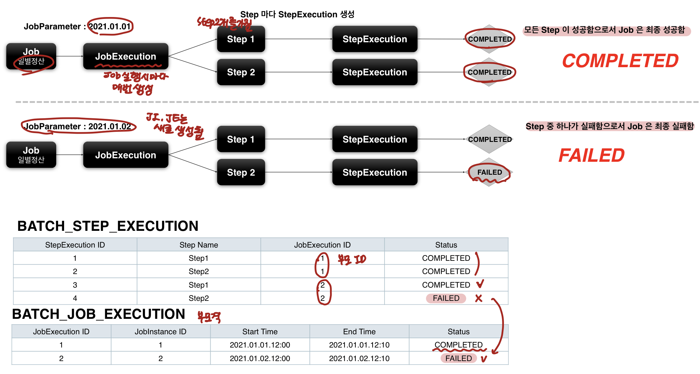

## StepExecution
- Step에 대한 한번의 시도를 의미하는 객체
- Step 실행 중 발생한 정보를 저장하고 있는 객체
	- 시작 시간, 종료시간, 상태(시작됨, 완료, 실패) commit count, rollback count 등 속성을 가짐 
- Step이 매번 시도때마다 생성되며 각 Step별로 생성된다
	- 각 Step 마다 Context를 가지며, 공유되지 않는다
- Job이 재시작해도 이미 성공한 Step은 Skip하고 실패한 Step만 실행된다.
	- ex) Job - JobExecution - Step1 성공, Step2 성공, Step3 실패
			Job 새로 재시작 - Step1, Step2 스킵 (옵션에 따라 다름) - Step 3만 실행
- Step이 실제 시작됐을 때만 StepExcution을 생성.
	- 이전 단계 Step이 실패해서 현재 Step을 실행하지 않았다면 StepExecution을 생성하지 않는다.
		- ex)  Step1 성공 -> StepExecution 생성
				Step2 실패 -> 실행 중 실패해서 SE 생성
				Step3 실패 -> 아예 실행도 안됨 SE 생성 X

- Step의 StepExcution이 완료되어야 JobExecution이 정상적으로 완료된다
	- JobExecution ID에 StepExecution이 딸려 있다
- Step의 Step Execution 중 하나라도 실패하면 JobExecution은 실패

- JobExecution과 StepExecution은 1:M 관계
- 하나의 Job에 여러 Step으로 구성한 경우 각 StepExection은 하나의 JobExecution을 부모로 가진다.

- StepExecution 도메인 이해 

![[IMG_4342.jpg]](./2022.02.image/IMG_4342.jpg)

## StepContribution
- Chunk Process의 변경사항을 버퍼링한 후 StepExecution 상태를 업데이트하는 도메인 객체
- Chunk Commit 직전에 StepExecution의 apply 메소드를 호출해 상태를 업데이트 함
- ExitStatus의 기본 종료 코드 외 사용자 정의 종료 코드로 변경할 수 있음

- 구조
	- Chunk Process의 기반이 되는 값을 가짐
		- readCount, writeCount, filterCount, parentSkipCount, readSkipCount, writeSkipCount, processSkipCount, ExitStatus, stepExecution

![[IMG_4343.jpg]](./2022.02.image/IMG_4343.jpg)